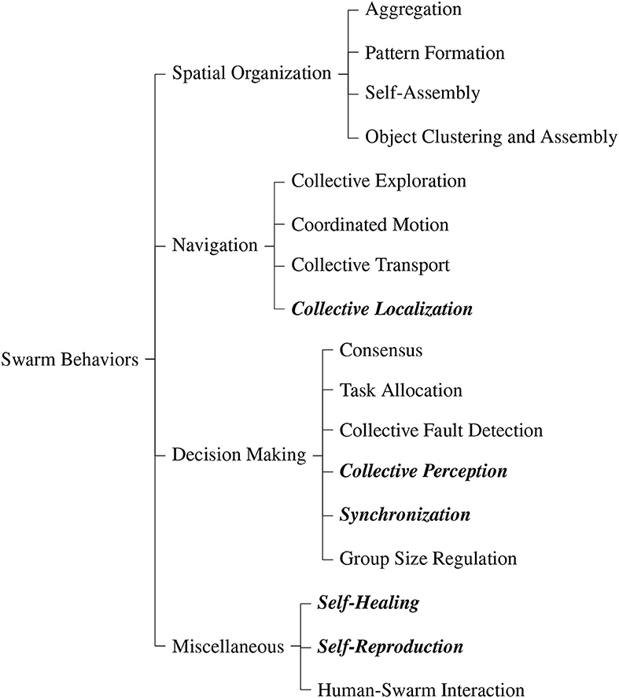

#Heterogeneous Swarm Literature Review
---
**Summary of My Thoughts**

Heterogeneous multi-robot systems (HMRS) have many varying applicaitons, and benefits over single robot systems. They also have other limitations. 

Benefits include:
- Robustness: HMRS have greater potential for redundancy, if robots within the system break the system should/could react well to that. 
- Larger Task Domain: HMRS could complete larger in magnetude tasks, and a larger variety of tasks using simpler component robots. 
- Parellelism: HMRS could increase magnitude/speed of tasks done through parellelizing work.

This is mitigated by:
- No Greater Framework: Most research focuses on indvidual components of the system, and is not integrated.
- More challenging design.

---
*Included Papers:*

1. [Cooperative Heterogeneous Multi-Robot Systems: A Survey](https://dl.acm.org/doi/pdf/10.1145/3303848)
2. [A Systematic Review of Swarm Robots](http://repository.futminna.edu.ng:8080/jspui/handle/123456789/11538)
3. [Cooperative Self-Organization in a Heterogeneous Swarm
Robotic System](https://dl.acm.org/doi/pdf/10.1145/1830483.1830501)
4. [Swarm Robotic Behaviors and Current Applications](https://www.frontiersin.org/articles/10.3389/frobt.2020.00036/full)
5. [A survey on multi-robot coverage path planning for model reconstruction and mapping](A survey on multi-robot coverage path planning for model reconstruction and mapping)
6. [The Robotarium: Globally Impactful Opportunities, Challenges, and Lessons Learned in Remote-Access, Distributed Control of Multirobot Systems](https://ieeexplore.ieee.org/stamp/stamp.jsp?tp=&arnumber=8960572)
7. [Cooperative Object Transport in Multi-Robot Systems: A Review of the State-of-the-Art](https://www.frontiersin.org/articles/10.3389/frobt.2018.00059/full)

---
*Notes on Paper 1:*

**Cooperative Heterogeneous Multi-Robot Systems: A Survey**

- Focuses on automating complex tasks, and lacks in credit assignment, consensus, containment control, and communication protocols. Though ref 30, 56 have more info.
- In intro suggest applications such as "health care, transportation systems, emergency response systems, household chores, and elderly
care, among others".
- Few "end-to-end frameworks have been presented", notes **swarmanoids** as one that tackles task automation. *"Natural language ontology and dictionaries could help automate complex task decomposition and big data advancements could be leveraged to improve perception and, consequently,
decision making."*
- Other reviews have covered aspects of tasks like "foraging,
formation control, cooperative object manipulation and displacement, path planning, and soccer". In manipulation, unknown objects make robots struggle, what about swarms for object scanning/locating/recognition?
- Writes of the multi-robot system workflow, and notably *"To the best of our knowledge, there are no implementations of fully automated systems, i.e., a complex task was given to the MRS, and the system autonomously decomposed this
complex task to sub-tasks, formed coalitions, and assigned and executed these sub-tasks."*
- Illustrates two MRS tasks in disaster response search robots with different specializations can search debris, larger robots can retrive, and transport robots can communicate with transportatio information, and traffic lights (robots?) to generate fastest routes to health care. In smart cities, elderly care could be enhanced with robotic monitoring/care in communication with health care robotics and transportation, and several independent sections of this system include previous work.
- Lists various MRS and their tasks and levels of autonomy. Many done in simulation only.
- Details approaches to coalition formation and task allocation, MAS planning and control, perception.
- Heterogeneous systems can increase the scope of solvable tasks, and lead to better performance with simpler agents through parallelism and robustness. More complex design.

**Struggles and Direction Notes**

*Big Data* - ML is beneficial, but limited on less capbable robotics, and cloud accessabillity may be limited in some environments. *"Future research should investigate methods to incorporate big data models into computationally constrained and communication restricted MRS applications to improve task planning and execution"*

*IoT* - Robot systems could be enhanced by IoT, sensor fusion and distributed sensing could aid perception for robotics.

*Task Complexity* - Decision making algorithms sturggle to recognize and decompose complex tasks autonomously. Suggests incorperating option for robots to contact humans. RL incorperating human operators to improve accuracy.

*Autonomous ML* - Could be incorperated to general angents that handle dynamic environments. Consider applying or extending algorithms developed for mobile devices to MRS. 

*Scalability and Heterogeneity Tradeoff* - Many robots acting on a system increases uncertainty in a system, and planning and control algorithms struggle with scalability and heterogeneity in very dynamic environments. Efficient planning balancing scalabillity and heterogeneity will help for applications like smart cities. Potentially hierarchical approaches where local interactions are dense, and global interactions are sparse could improve scalability with heterogeneity.

*Coalition Formation and Task Allocation* - *"Simultaneous coalition formation and task allocation could lead to more optimal mappings and
should be investigated further, since only a few works have considered this approach but obtained
promising results."*

*Human-in-the-Loop* - Human in the loop systems/architectures have potential benefits, and potential drawbacks, so figuring out if including humans in a sytem is beneficial or detrimental could be useful.

*Transfer Learning* - *"Transfer learning has been applied to MAS [151, 212] and MRS [50] but has yet to be tested in end-to-end systems deployed in the real world on complex tasks. Furthermore, transfer learning for RL has been mainly tested on benchmark problems and gaming environments but not in real-world environments.*"

*Unified Framework* - Deployments are limited by the lack of interaction between work on various sections of MRS. Work on sections of MRS task completion should be viewed as parts of a whole, and it should be possible to interact between sections of the problem. E2E sim and real world experiments should be used to improve and validate formulated models.

*Other* - Communication and connectivity constraints complicate problems. Evaluation standards for MRS are also very underdeveloped.

---

*Notes on Paper 2:*

**A Systematic Review of Swarm Robots**

- Classifies multi-robot systems as robots as swarm robots if they are relatively homogenous, so may not be as relevant.
- Notes that swarms suffer from interference, uncertainty, safety, and lack of reliable communication. Also notes rarely applied to real problems, though potential applications include medicine, in localizing cancer cells, agriculture, through smarter cheaper approaches to agriculture, search and rescue missions, oil spill cleanup, already done by Seaswarm, exploration, and millitary use.
- Embarassingly, the paper falls for the common misconception that WiFi stands for Wireless Fidelity in 3.3.4.
-Swarm robotics platforms include kilobot, Collective Cognitive Robots, swarmbot, Milybot, Polybot, and Colias.

---

*Notes on Paper 3:*

**Cooperative Self-Organization in a Heterogeneous Swarm
Robotic System**

This is a Swarmanoid paper, investigating "mutual adaptation". In a simulated study, their process where "eye bots" communicate with "foot-bots" to forage through cluttered environments, helping to find the shortest path through that environment.

---

*Notes on Paper 4:*

**Swarm Robotic Behaviors and Current Applications**

- Notes that swarms "form advantagious structures and behaviours similar to natural systems". 

*"Literature is light on real-world swarm applications that apply actual swarm algorithms. Typically, only parts of swarm algorithms are used which we refer to as basic swarm behaviors. In this paper we collect and categorize these behaviors into spatial organization, navigation, decision making, and miscellaneous."*

Also notes that distributed decision making is neglected, because emergent behavior is hard to predict, and industrial use is hard to come up with. Current communication also does not fit the swarm model. 

This paper seems to consider distributed decision making a critical part of swarms.

Classifies swarm tasks into this taxonomy:

Goes on to list approaches to these tasks, and list research platforms for swarms.

---

*Notes on Paper 4:*

**A survey on multi-robot coverage path planning for model reconstruction and mapping**

*"Coverage path planning (CPP) is one of the active research topics that could benefit greatly from multi-robot systems."*

It's about computing a path over a set of points such that the if you scan at the points, you can completely scan the environment. (Cited papers mostly mention disaster relief.) This is composed of viewpoint generation, and coverage path generation. *"Typical common [MRS] objectives include surveillance, monitoring, surveying, and modeling."* For applications, it notes S&R, forest fire monitoring, industrial inspection, and natural disastier monitoring and relief.
